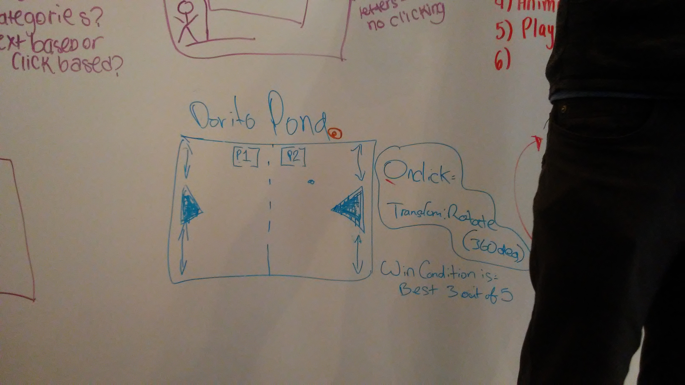

# Project Overview

## Project Schedule

This schedule will be used to keep track of your progress throughout the week and align with our expectations.  

|  Day | Deliverable | 
|---|---| 
|Day 1: Tue| Wireframes and Priority Matrix|
|Day 2: Wed| Project Approval /  Pseudocode / actual code|
|Day 3: Thur| Basic Clickable Model |
|Day 4: Fri| Working Prototype |
|Day 5: Sat| Final Working Project |
|Day 6: Sun| Bugs / Stylying / PostMVP |
|Day 7: Mon| Project Presentations |

## Project Description

Dorito Pong: game played just like pong, but with a triangular deflector that can be spun left or right to change the trajectory of the ball.

## Wireframes

Include images of your wireframes. 
	;

## Priority Matrix
 `Time and Importance`   
 metric(T,I) 1 out of 8

i.triangle deflector (3,5)
ii.ball(2,6)
iii.canvas that serves as the board(1,7)
iv. way to begin game at landing page and choose
	"nacho" or "cool ranch"(4,3)
v.win condition for best 3 out of 5(7,1)
vi.way to restart game.(5,4)
vii.way to keep track of wins of "dorito"vs"cool 		    ranch". (8,8)
viii.physics and trajectory of th ball (6,2)

;

## Game Components

### Landing Page
What will a player see when they start your game?
	A start page with 2 buttons named "nacho" and "cool ranch"
	One being left side and the other being the right.

### Game Initialization
What will a player see when the game is started? 
	A start page

### Playing The Game
What will be the flow of the game, what will the user be expeted to do and what will the user expect from the game.

	The user will be expected to not let the ball hit the wall on their side and attempt to hit the wall on the opponents side; very similar to tennis or soccor.

### Winning The Game
What does it look like when the game ends, what determines winning or losing?
	The first to win 3 games wins, and a Victory animation will appear before the game goes back to the main menu

### Game Reset
How will the user restart the game once it has been completed.
   The game will restart once wind condition is met. and a tally of Victories will be logged at the load.

## MVP 

Include the full list of features that will be part of your MVP 
	i.trajectry of the pong
   ii. functions of the game
  iii. physics and boundaries

## POST MVP

Include the full list of features that you are considering for POST MVP
	i.a winning animation
   ii. log of victories for teams
## Functional Components

Based on the initial logic defined in the previous game phases section try and breakdown the logic further into functional components, and by that we mean functions.  Does your logic indicate that code could be encapsulated for the purpose of reusablility.  Once a function has been defined it can then be incorporated into a class as a method. 

Time frames are also key in the development cycle.  You have limited time to code all phases of the game.  Your estimates can then be used to evalute game possibilities based on time needed and the actual time you have before game must be submitted. 

| Component | Priority | Estimated Time | Time Invetsted | Actual Time |

| Visuals   | H | 3hrs| 12hrs | 12hrs |
| Functions | H |10hrs|       |       |
| animation | L | 4hrs|       |       |
| landing   | M | 3hrs|       |       |
| restart   | M | 3hrs|       |       |
| Victories | L | 5hrs|       |       |
| Total     |   |28hrs| 12hrs | 12hrs |

## Helper Functions
Helper functions should be generic enought that they can be reused in other applications. Use this section to document all helper functions that fall into this category.

| Function | Description | 
| --- | :---: |  
| Capitalize | This will capitalize the first letter in a string | 

## Additional Libraries
 Use this section to list all supporting libraries and thier role in the project. 

## Code Snippet

Use this section to include a brief code snippet of functionality that you are proud of an a brief description.  

## jQuery Discoveries
 Use this section to list some, but not all, of the jQuery methods and\or functionality discovered while working on this project.

## Change Log
 Use this section to document what changes were made and the reasoning behind those changes.  

## Issues and Resolutions
 Use this section to list of all major issues encountered and their resolution.

#### SAMPLE.....
**ERROR**: app.js:34 Uncaught SyntaxError: Unexpected identifier                                
**RESOLUTION**: Missing comma after first object in sources {} object